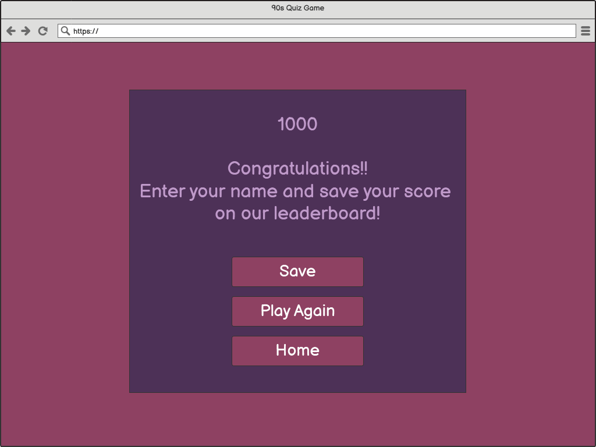

# 90's Quiz Game - JavaScript Project

## About
This is a general knowledge quiz of the 90's. To test how much you know or remember about the time internet wasn't that popular. It doesn't matter if you're a Boomer, Millenial or GenZ. 

[Link](https://c-argus.github.io/90squizgame/) to the live Website

## Responsive Design 


## UX 
The project is a graphical user interface of a website quiz. Through the use of HTML, CSS, and JavaScript it demonstrates my programming knowledge.

## User Stories
* A progress bar to provide visual feedback to the user with information about how many questions are left;
* A toggle button so the user can decide whether the sound is on or off;
* A scoretrack system;
* Choose a nickname to be shown on the leaderboard.

## Design
### Colour Scheme
The colour palette was created using [Coolors](https://coolors.co/).


### Wireframes
To create the wireframes I used [Balsamic](https://balsamiq.com/). It helped me visualize the design before I started to build the website.
#### Wireframe of the home page

#### Wireframe of the quiz game structure

#### Wireframe of the result structure

#### Wireframe of the leaderboard structure


### Typography
There are 3 different fonts being used on the website. The combination was generated by the [Fontjoy](https://fontjoy.com/) website and the font style is from [Google Fonts](https://fonts.google.com/).
* [Monoton](https://fonts.google.com/?query=Monoton) was used for the title of the game;
* [Merriweather Sans](https://fonts.google.com/?query=Merriweather+San) for the home page and the questions;
* [Viga](https://fonts.google.com/?query=viga) for the final page and leaderboard;
* [Amiko](https://fonts.google.com/?query=amiko) for the buttons;
* [Dancing Script](https://fonts.google.com/?query=dancing+script) for the "Thank you" page.

The icon on the last page and the leaderboard are from [Font Awsome](https://fontawesome.com/) and the favicon is from [FontIcon](https://gauger.io/fonticon/).

## Features
### Existing Features
The quiz game question bank holds 50 questions at the moment. When a user starts the game, the code will select ten questions at random. So every time a user begins a game, they will never be in the same order or questions. After finishing the quiz, the user will get to choose a nickname to be shown with the total score at the leaderboard.

### **Home Page**
* The first screen is the home page. The title sit on the top of the quiz so the user can see  clearly the intentions of the page. The menu options contains two buttons:

    * **Play**, to start the game; 
    * **Scores**, to see the leaderboard.

The user can start the game whenever they are ready. The quiz's first question will not display until the user clicks on the button.


### **Questions Page**
For every question, the user will get four options to choose from, and one of these is the correct one. The quiz requires the user to select an answer before moving on to the next question.
If the answer is correct, it will light up in green and the *correct answer sound* will buzz. If it's wrong it will light up in red and the *wrong answer sound* will buzz. The code doesn't show which answers are correct if the user would like to retake the quiz.
When a user submits an answer, they can keep track of their score and how many questions were answered and how many are left.
There's also a toggle button that permits the user to turn on and off the sounds as prefered. 


### **Score Page**
Upon finishing the quiz, the user will be presented with their score and the option to choose a nickname to go on the leaderboard. They can also choose to play again or return to the Home page.
The option of saving the nickname is also available if a nickname is provided.


### **Leaderboard**
If the user chooses to save their nickname, it brigs them to the Leaderboard page. Where it shows the previous users scores and nicknames.
From that page the user can return to the Home page.


## Features Left to Implement
* The user would get the option to choose the degree of difficulty of the quiz, like easy, medium, pro.
* Update the questions, using images, videos and sound to make the user experience more plesant and fun.

## Testing

* Internal Links
  - All internal links were tested to make sure that all pages are correctly connected.
  - Navigations links brings the user to the relevant pages.

* Forms
  - All the forms were tested and works perfectly, it requires entries in every field, will only save the nickname if provided, and the save button works.

### JSHint
* No errors reported using JSHint website when using the following parameters (entered at the top of the code section):

```//jshint esversion:6
// Tell JSHint the currentQuiz global variable
// can be overwritten


### HTML validator
* Home Page - [Results](https://validator.w3.org/nu/?showsource=yes&showoutline=yes&showimagereport=yes&doc=https%3A%2F%2Fc-argus.github.io%2F90squizgame%2F)
* Questions Page - [Results](https://validator.w3.org/nu/?showsource=yes&showoutline=yes&showimagereport=yes&doc=https%3A%2F%2Fc-argus.github.io%2F90squizgame%2Fgame.html)
* Score Page - [Results](https://validator.w3.org/nu/?showsource=yes&showoutline=yes&showimagereport=yes&doc=https%3A%2F%2Fc-argus.github.io%2F90squizgame%2Ffinishpage.html)
* Leaderboard Page - [Results](https://validator.w3.org/nu/?showsource=yes&showoutline=yes&showimagereport=yes&doc=https%3A%2F%2Fc-argus.github.io%2F90squizgame%2Fscorespage.html)

### Usability Testing

* To test navigation and responsive tools, the website was shared with friends and family of different ages and different levels of computer/smart device knowledge. There were no issues idenfied regarding the simplicity of navigating the website.
* The testers also verified that all buttons and links works as expected.

### Compatibility Testing

* The website was tested for responsiveness on Chrome DevTools. Different viewport sizes were simulated ranging from as small as iPhone 5 (320px) to large desktop sizes (1200px and above).

* Browser Compatibility
  - The website was tested and works as expected in different browsers, such as Firefox, Chrome, Brave and Safari.

  ### Accessibility Testing

* The colours and fonts chosen for each page are easy to read and accessible by running it though lighthouse in DevTools.

  - *Home Page*

  

  - *Questions Page*

  

  - *Final Score Page*

  

  - *Leaderboard Page*

  

## Deployment

### Publishing
The website was published using [GitHub Pages](https://github.com/), using the steps presented:

1. Go to the GitHub website and log in.
2. On the left-hand side, you'll see all your repositories, select the appropriate one. ([Repository](https://github.com/c-argus/kids-in-the-kitchen) used for this project).
3. Under the name of your chosen Repository you will see a ribbon of selections, click on *Settings* located on the right hand side.
4. On the left side menu, located on **Code and automation** section you will find the link for **Pages**. 
5. Once in GitHub Pages,  under the *Source* click on the dropdown and select *Deploy from a branch*, under the *Branch* click on the dropdown and select *main* and *Save*.
6. Reload the page and you'll see the link of your published page displayed under *GitHub pages*. 
7. It takes a few minutes for the site to be published.

## Bugs
There are no identified bugs as at now.

## Credits

### Code
* Gitpod was used to create a responsive HTML, CSS and JavaScript code. 
* CodeInstitute Full Template was used to create the Gitpod workspace.
* [How to Make a Quiz App by Brian Design](https://www.youtube.com/watch?v=f4fB9Xg2JEY&list=PLj7llf6L2DgLIv9_34_ZrJXzK6taZU9qd&index=3&t=3209s)

### Content
* Colour scheme was created using [Coolors](https://coolors.co/).
* The icons in the Score Page and the Leaderboard Page were taken from [Font Awesome](https://fontawesome.com/).
* Fonticon was taken from [FontIcon](https://gauger.io/fonticon/).
* [Mixkit](https://mixkit.co/) for the alert sounds.
* [83 Best 1990’s Trivia Questions and Answers](https://groupgames101.com/90s-trivia-questions/) and [90’s Trivia Questions](https://ponly.com/90s-trivia-questions/) for the questions.
* [W3Schools](https://www.w3schools.com/) for extra knowledge.
* To write up the README file the documents used as guidence were:
  - Code Institute [Sample Project README.md](Sample Project README.md);
  - [README Template](https://github.com/Code-Institute-Solutions/readme-template);
  - [Basic writing and formatting syntax](https://docs.github.com/en/get-started/writing-on-github/getting-started-with-writing-and-formatting-on-github/basic-writing-and-formatting-syntax).

### Acknowledgements

* Thank you to my mentor for the guidance and advices. 
* Thank you to my parter that was very patient and supportive throughout the process of creation of this website.
* Thank you to my friends and family that helped during the testing process.


