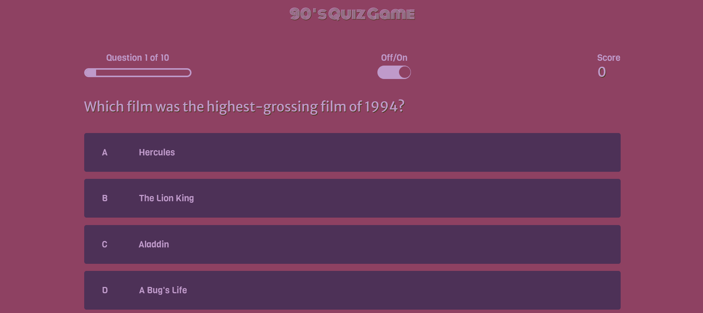

# 90's Quiz Game - JavaScript Project

## About
This is a general knowledge quiz of the 90's. To test how much you know or remember about the time internet wasn't that popular. It doesn't matter if you're a Boomer, Millenial or GenZ. 

[Link](https://c-argus.github.io/90squizgame/) to the live Website

## Responsive Design 

## UX 
The project is a graphical user interface of a website quiz. Through the use of HTML, CSS, and JavaScript it demonstrates my programming knowledge.

## User Stories
* A progress bar to provide visual feedback to the user with information about how many questions are left;
* A toggle button so the user can decide whether the sound is on or off;
* A scoretrack system;
* Choose a nickname to be shown on the leaderboard.

## Design
### Colour Scheme
The colour palette was created using [Coolors](https://coolors.co/).

### Wireframes
To create the wireframes I used [Balsamic](https://balsamiq.com/). It helped me visualize the design before I started to build the website.
#### Wireframe of the home page

#### Wireframe of the quiz game structure

#### Wireframe of the result structure

#### Wireframe of the leaderboard structure

### Typography
There are 3 different fonts being used on the website. The combination was generated by the [Fontjoy](https://fontjoy.com/) website and the font style is from [Google Fonts](https://fonts.google.com/).
* [Monoton](https://fonts.google.com/?query=Monoton) was used for the title of the game;
* [Merriweather Sans](https://fonts.google.com/?query=Merriweather+San) for the home page and the questions;
* [Viga](https://fonts.google.com/?query=viga) for the final page and leaderboard;
* [Amiko](https://fonts.google.com/?query=amiko) for the buttons;
* [Dancing Script](https://fonts.google.com/?query=dancing+script) for the "Thank you" page.

The icon on the last page and the leaderboard are from [Font Awsome](https://fontawesome.com/) and the favicon is from [FontIcon](https://gauger.io/fonticon/).

## Features
### Existing Features
The quiz game question bank holds 50 questions at the moment. When a user starts the game, the code will select ten questions at random. So every time a user begins a game, they will never be in the same order or questions. After finishing the quiz, the user will get to choose a nickname to be shown with the total score at the leaderboard.

### **Home Page**
* The first screen is the home page. The title sit on the top of the quiz so the user can see  clearly the intentions of the page. The menu options contains two buttons:

    * **Play**, to start the game and; 
    * **Scores**, to see the leaderboard.

The user can start the game whenever they are ready. The quiz's first question will not display until the user clicks on the button.

### **Questions Page**
For every question, the user will get four options to choose from, and one of these is the correct one. The quiz requires the user to select an answer before moving on to the next question.
If the answer is correct, it will light up in green and the "correct answer sound" will buzz. If it's wrong it will light up in red and the "wrong answer sound will buzz". The code doesn't show which answers are correct if the user would like to retake the quiz.
When a user submits an answer, they can keep track of their score and how many questions were answered and how many are left.
There's also a toggle button that permits the user to turn on and off the sounds as prefered. 

### **Score Page**
Upon finishing the quiz, the user will be presented with their score and the option to choose a nickname to go on the leaderboard. They can also choose to play again or return to the Home page.
The option of saving the nickname is also available if a nickname is provided.

### **Leaderboard**
If the user chooses to save their nickname, it brigs them to the Leaderboard page. Where it shows the previous users scores and nicknames.
From that page the user can return to the Home page.

## Features Left to Implement
* The user would get the option to choose the degree of difficulty of the quiz, like easy, medium, pro.
* Add more questions but using images, videos and sound to make the user experience more plesant and fun.

